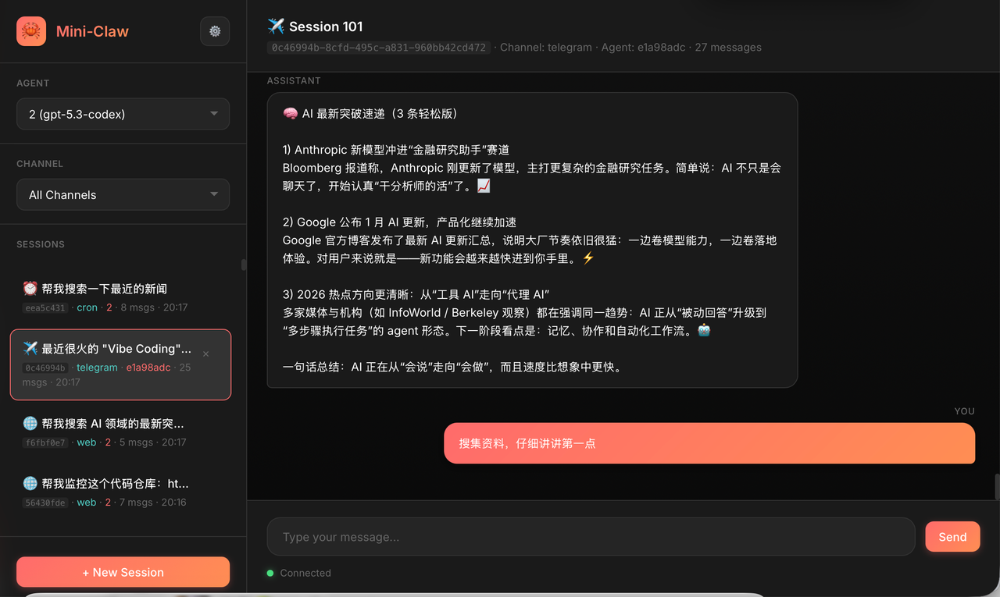
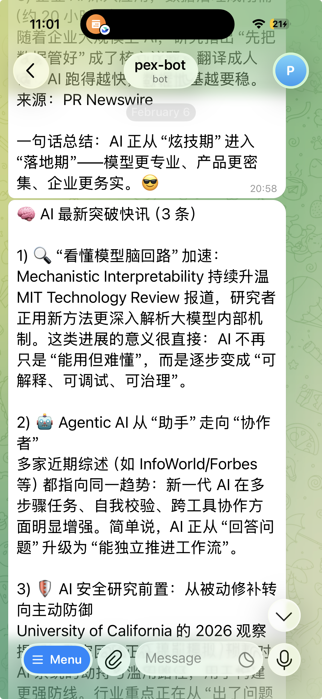

# Mini-Claw

Multi-platform AI agent framework. Gateway 接收来自 WebSocket / Telegram / Cron 的消息，路由到 Agent，Agent 调用 LLM + Tools 完成任务并回复。

| Web UI | Telegram |
|--------|----------|
|  |  |

## Prerequisites

- **Bun** >= 1.1 (runtime, NOT Node.js)
- 一个 OpenAI 兼容 或 Claude API key

## Quick Start

```bash
# 1. 安装依赖
cd mini-claw
bun install

# 2. 初始化配置（交互式，生成 ~/.mini-claw/config.json）
bun src/entry.ts config init

# 3. 启动 Gateway（HTTP + WebSocket 共享端口 18789）
bun src/entry.ts gateway

# 4. 另开终端，启动 CLI 聊天
bun src/entry.ts chat
```

也可用 package.json 中的快捷命令：

```bash
pnpm gateway    # = bun src/entry.ts gateway
pnpm agent      # = bun src/entry.ts chat
pnpm cron       # = bun src/entry.ts cron
pnpm telegram   # = bun src/entry.ts telegram
```

## Configuration

配置文件位于 `~/.mini-claw/config.json`，可通过 `config init` 交互生成，也可手动编写：

```jsonc
{
  "meta": { "version": "1.0.0" },
  "gateway": { "port": 18789, "host": "0.0.0.0" },
  "providers": {
    "providers": {
      "default": {
        "id": "default",
        "name": "OpenAI",
        "baseUrl": "https://api.openai.com/v1",  // 或任何 OpenAI 兼容端点
        "apiKey": "sk-xxx",
        "format": "openai",                       // "openai" | "claude"
        "models": ["gpt-4o"]
      }
    },
    "defaultProviderId": "default"
  },
  // 可选
  "telegram": { "botToken": "123:ABC", "allowFrom": ["user_id"] },
  "composio": { "apiKey": "xxx" }
}
```

环境变量 `MINI_CLAW_CONFIG_DIR` 可覆盖配置目录（默认 `~/.mini-claw`）。

## Architecture

```
                         ┌──────────────────────────────────────────┐
                         │              Gateway (:18789)            │
                         │                                          │
  WebSocket client ─────►│  ChannelRegistry                         │
  Telegram bot ─────────►│    ├─ WebSocketChannel                   │
  Cron timer ───────────►│    ├─ TelegramChannel (grammY)           │
                         │    └─ CronChannel                        │
                         │         │                                │
                         │         ▼                                │
                         │  FollowupQueue (steer mode)              │
                         │         │                                │
                         │         ▼                                │
                         │  BindingManager → route to AgentRunner   │
                         │         │                                │
                         │         ▼                                │
                         │  AgentRunner                             │
                         │    ├─ LLMClient (OpenAI / Claude stream) │
                         │    ├─ Tools (bash, read, write, ...)     │
                         │    └─ Skills (SKILL.md auto-load)        │
                         │                                          │
                         │  SessionAPI (HTTP REST)                  │
                         │  SessionManager (JSON + JSONL transcripts)│
                         └──────────────────────────────────────────┘
```

### Message Flow

1. Channel 收到消息 → `Gateway.handleMessage()`
2. 若 Agent 正在运行 → 消息入 FollowupQueue（steer mode 立即注入）
3. 若 Agent 空闲 → `Gateway.processMessage()` → BindingManager 路由 → 获取/创建 AgentRunner
4. `AgentRunner.run()` → LLM 调用 → Tool 执行循环（最多 10 轮）→ 回调返回结果
5. 结果通过 Channel 发回

### Steer Mode（打断对话）

Agent 运行中收到新消息时，消息以 `[INTERRUPT]` 前缀注入当前对话上下文，Agent 会感知并调整行为。

## Tools

Agent 可调用的内置工具：

| Tool | File | Description |
|------|------|-------------|
| `bash` | `src/agents/tools/bash.ts` | 执行 shell 命令（30s 超时） |
| `read` | `src/agents/tools/read.ts` | 读取文件内容 |
| `write` | `src/agents/tools/write.ts` | 创建/覆盖文件 |
| `web_fetch` | `src/agents/tools/web-fetch.ts` | 抓取 URL 内容 |
| `cron` | `src/agents/tools/cron.ts` | 管理定时任务 |
| `telegram_send` | `src/agents/tools/telegram-send.ts` | 发送 Telegram 消息 |
| `session_send` | `src/agents/tools/session-send.ts` | 发送消息到 Web UI 会话 |
| `subagent_spawn` | `src/agents/tools/subagent-spawn.ts` | 派生后台子 Agent 并行执行 |
| `skill` | `src/agents/tools/skill.ts` | 加载 SKILL.md 指令 |

Composio 工具在配置了 `composio.apiKey` 后动态加载。

## CLI Commands

```bash
bun src/entry.ts <command>

# 核心
gateway                              # 启动 Gateway 服务
chat                                 # 交互式 CLI 聊天

# Agent 管理
agents list                          # 列出所有 Agent
agents create <name> <model>         # 创建 Agent（-d 描述, -u baseUrl）
agents delete <agentId>              # 删除 Agent
agents default <agentId>             # 设置默认 Agent

# Session 管理
sessions list [-a agentId]           # 列出会话
sessions show <sessionId>            # 查看会话消息
sessions create [-a agentId] [-t title]
sessions delete <sessionId>

# Cron 定时任务
cron list                            # 列出任务
cron add "<schedule>" "<message>"    # 添加（如 "*/5 * * * *" "检查服务状态"）
cron remove <id>                     # 删除

# 配置
config init                          # 交互式初始化
config show                          # 显示当前配置
config path                          # 打印配置文件路径
config dir                           # 打印配置目录路径

# Telegram
telegram "<message>"                 # 通过 mock Telegram 发送消息
```

## HTTP API

Gateway 启动后在同一端口提供 REST API：

| Method | Path | Description |
|--------|------|-------------|
| GET | `/api/providers` | 列出 LLM providers |
| POST | `/api/providers` | 创建 provider |
| PUT | `/api/providers/:id` | 更新 provider |
| DELETE | `/api/providers/:id` | 删除 provider |
| POST | `/api/providers/:id/set-default` | 设为默认 |
| GET | `/api/models` | 列出所有可用模型 |
| GET | `/api/agents` | 列出 agents |
| POST | `/api/agents` | 创建 agent |
| PUT | `/api/agents/:id` | 更新 agent |
| DELETE | `/api/agents/:id` | 删除 agent |
| POST | `/api/agents/:id/set-default` | 设为默认 |
| GET | `/api/sessions` | 列出会话（?agentId=&channel=） |
| POST | `/api/sessions` | 创建会话 |
| GET | `/api/sessions/:id` | 会话详情 |
| GET | `/api/sessions/:id/messages` | 会话消息历史 |
| DELETE | `/api/sessions/:id` | 删除会话 |
| GET | `/api/bindings` | 列出路由绑定 |
| POST | `/api/bindings` | 创建绑定 |
| PUT | `/api/bindings/:id` | 更新绑定 |
| DELETE | `/api/bindings/:id` | 删除绑定 |
| POST | `/api/bindings/resolve` | 测试路由解析 |
| GET | `/api/cron` | 列出 cron jobs |
| POST | `/api/cron` | 创建 cron job |
| PUT | `/api/cron/:id` | 更新 cron job |
| DELETE | `/api/cron/:id` | 删除 cron job |
| POST | `/api/cron/:id/enable` | 启用 |
| POST | `/api/cron/:id/disable` | 禁用 |
| POST | `/api/cron/:id/duplicate` | 复制 |

静态文件从 `public/` 目录提供（`/` → `public/index.html`）。

## File Structure

```
mini-claw/
├── src/
│   ├── entry.ts                    # 入口
│   ├── index.ts                    # 模块导出
│   ├── cli/                        # CLI 命令
│   │   ├── program.ts              # Commander 主程序
│   │   ├── gateway-cli.ts          # gateway 命令
│   │   ├── agent-cli.ts            # chat 命令（交互式）
│   │   ├── agents-cli.ts           # agents 管理命令
│   │   ├── sessions-cli.ts         # sessions 管理命令
│   │   ├── config-cli.ts           # config 命令
│   │   ├── cron-cli.ts             # cron 命令
│   │   └── telegram-cli.ts         # telegram 命令
│   ├── gateway/
│   │   ├── server.ts               # Gateway 核心（消息路由、Agent 生命周期）
│   │   ├── session-api.ts          # HTTP REST API
│   │   └── gateway-ref.ts          # Gateway 引用（供 tools 回调）
│   ├── agents/
│   │   ├── runner.ts               # AgentRunner（LLM 调用 + Tool 循环）
│   │   ├── llm-client.ts           # LLM 客户端（OpenAI/Claude 双格式流式）
│   │   ├── manager.ts              # Agent 配置管理
│   │   ├── tools/                  # 工具实现
│   │   │   ├── index.ts            # 工具注册表
│   │   │   ├── types.ts            # Tool 接口定义
│   │   │   ├── bash.ts             # shell 执行
│   │   │   ├── read.ts             # 文件读取
│   │   │   ├── write.ts            # 文件写入
│   │   │   ├── web-fetch.ts        # URL 抓取
│   │   │   ├── cron.ts             # 定时任务管理
│   │   │   ├── telegram-send.ts    # Telegram 发送
│   │   │   ├── session-send.ts     # Web 会话发送
│   │   │   ├── subagent-spawn.ts   # 子 Agent 派生
│   │   │   ├── skill.ts            # Skill 加载
│   │   │   └── composio.ts         # Composio 动态工具
│   │   └── skills/
│   │       ├── loader.ts           # SKILL.md 加载器
│   │       └── types.ts            # Skill 类型
│   ├── channels/
│   │   ├── registry.ts             # Channel 注册表
│   │   ├── websocket.ts            # WebSocket channel
│   │   ├── telegram.ts             # Telegram channel (grammY)
│   │   ├── cron.ts                 # Cron channel
│   │   └── types.ts                # Message/Channel 接口
│   ├── config/
│   │   ├── config-manager.ts       # 配置文件管理（~/.mini-claw/config.json）
│   │   ├── provider-manager.ts     # Provider 管理（model→provider 解析）
│   │   └── types.ts                # 配置类型
│   ├── sessions/
│   │   ├── manager.ts              # 会话管理（JSON 元数据 + JSONL 转录）
│   │   └── index.ts                # 导出
│   ├── routing/
│   │   ├── manager.ts              # 路由绑定管理（channel/peer→agent）
│   │   └── index.ts                # 导出
│   ├── cron/
│   │   ├── service.ts              # Cron 调度服务
│   │   ├── store.ts                # Job 持久化
│   │   ├── singleton.ts            # 单例访问
│   │   └── types.ts                # CronJob 类型
│   ├── queue/
│   │   ├── followup-queue.ts       # 消息队列（steer mode）
│   │   └── types.ts                # 队列类型
│   └── infra/
│       ├── env.ts                  # 环境配置（从 config.json 读取）
│       └── logger.ts               # 日志
├── skills/                         # SKILL.md 文件（自动加载到 system prompt）
├── data/                           # 运行时数据
│   ├── cron.json                   # Cron jobs
│   ├── agents/agents.json          # Agent 配置
│   ├── sessions/                   # 会话数据
│   │   ├── sessions.json           # 会话元数据
│   │   └── transcripts/*.jsonl     # 消息历史
│   └── routing/bindings.json       # 路由绑定
├── public/                         # 静态文件（Web UI）
│   └── index.html
├── scripts/                        # 运维脚本
├── docs/                           # 文档
├── package.json
└── tsconfig.json
```

## Adding Custom Skills

在 `skills/` 下创建目录和 `SKILL.md` 文件，Gateway 启动时自动加载并追加到 system prompt：

```bash
mkdir -p skills/my-skill
echo "# My Skill\n\nInstructions for the AI..." > skills/my-skill/SKILL.md
```

## Adding Custom Tools

1. 在 `src/agents/tools/` 创建文件，实现 `Tool` 接口（`name`, `description`, `inputSchema`, `execute`）
2. 在 `src/agents/tools/index.ts` 的 `builtinTools` 数组中注册

## Key Design Patterns

- **Singleton**: SessionManager, AgentManager, ProviderManager, BindingManager 均通过 `get*()` 工厂函数获取单例
- **Model→Provider 解析**: Agent 指定 model 名，ProviderManager 自动查找包含该 model 的 provider 获取 apiKey/baseUrl
- **双格式 LLM**: LLMClient 同时支持 OpenAI 和 Claude API 格式，通过 `format` 字段切换
- **流式响应**: 所有 LLM 调用使用 SSE 流式解析，支持 onChunk/onToolCall 回调
- **会话持久化**: 消息以 JSONL 格式追加写入，支持跨重启恢复对话
